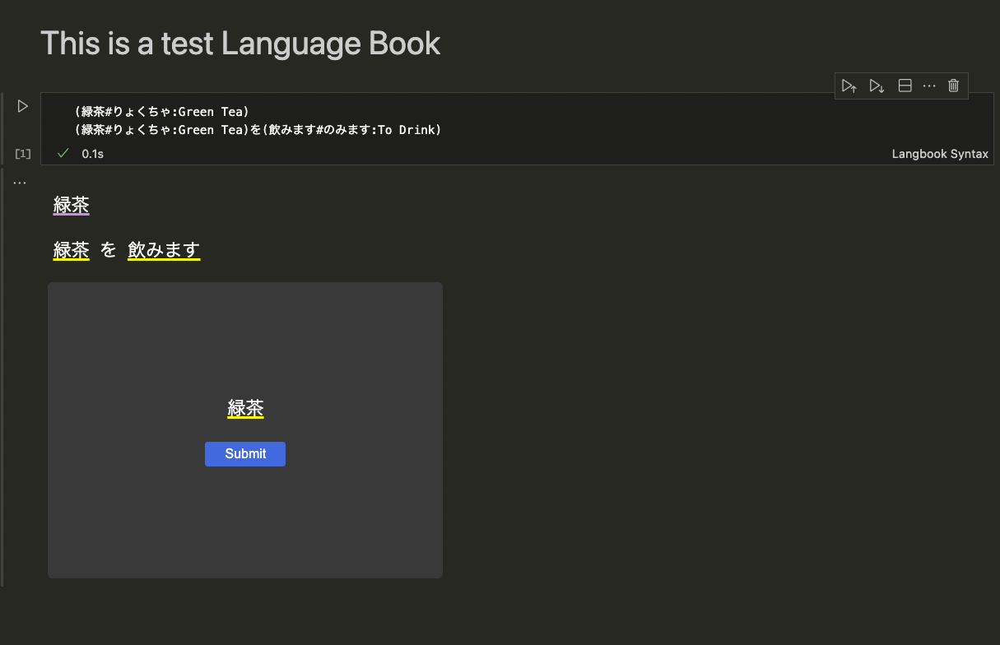
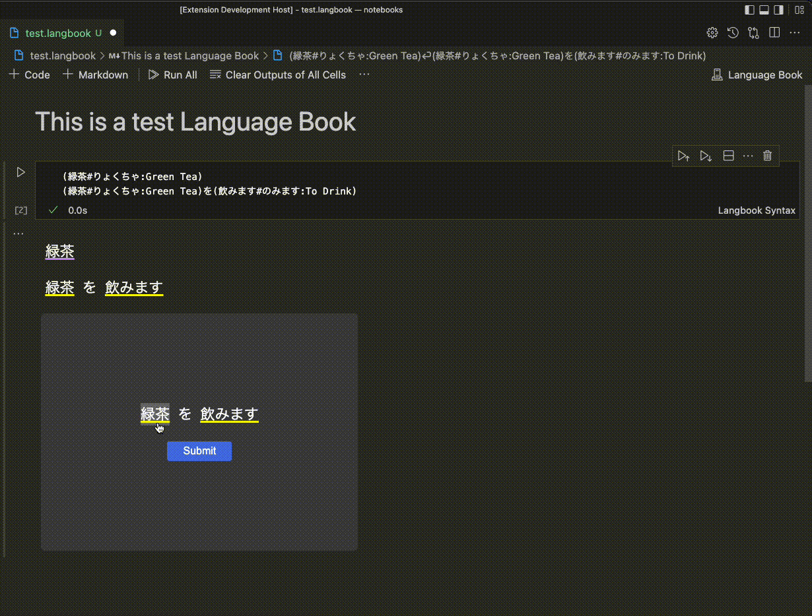

#  Language Book

Language Book is a Visual Studio Code extension that allows you to write and practice vocab in a Notebook interface.

## Features

- Link pronunciation and definition to vocab word
- Add standalone vocab or use words in a sentence
- Add a meaning or pronunciation for a whole sentence
- Autogenerated quiz to practice
- List of words/sentences that hide data until hover

## Usage

### To Create a Langbook

1. Create a file with the .langbook exe
2. Add markdown or code sections

### To Quiz

1. The quiz will be autogenerated and randomly choose a line
2. Click on the underlined words and a prompt will appear
3. Type your answer into the prompt
4. When all of your answers are added "submit" to check your answers
5. Click next to get the next random line

## Langbook Syntax

### Add a singular word

- With pronunciation and definition: `(word#pronunciation:definition)`
- With pronunciation only: `(word#pronunciation)`
- With definition only: `(word:definition)`

### Add words in sentence

`(word#pro:def) other sentence words (word#pro:def)`

### Examples

- Singular Word: `(緑茶#りょくちゃ:Green Tea)`
- Words in a sentence: `(お茶#おちゃ:Tea)が(好き#すき:Like)です`
- A whole sentece: `(お茶が好きです:I like tea)`

## Release Notes

### 1.0.0

Initial release
